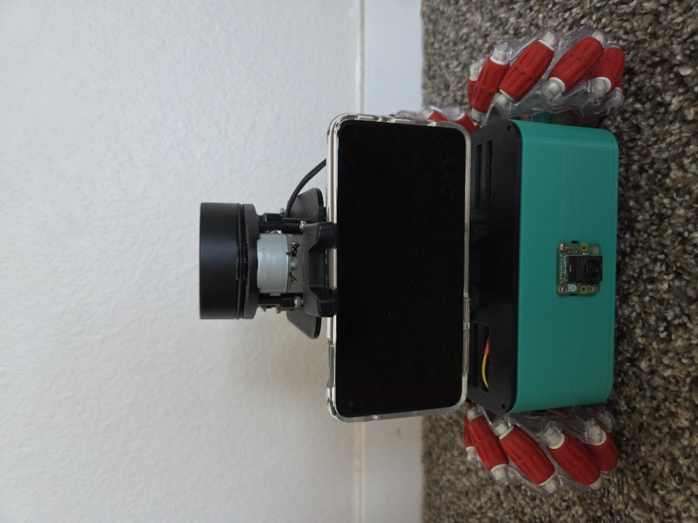
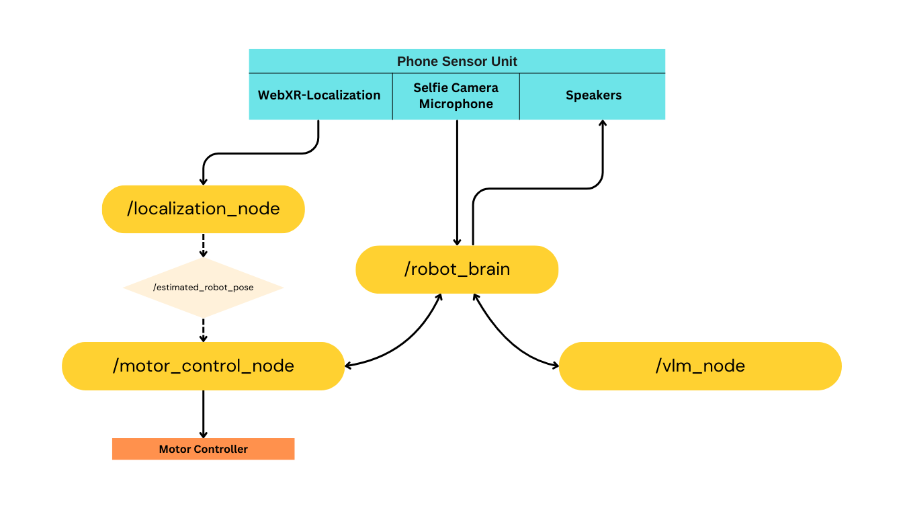

# Roll-E: Meccanum Wheel LLM Controlled Robot

This project explores integrating large language models (LLMs) with mobile robotics, enabling natural language interaction, visual scene understanding, and localization. While currently implemented on a mobile robot, the approach is adaptable to various robotic platforms.

## Overview
🤖 **What if your robot had its own brain?**  
Roll-E is designed to combine LLM-based reasoning with real-world robotics, allowing for natural language control, autonomous movement, and basic task execution. An android smartphone serves as the robot’s sensor hub, providing:

- **RGB Camera Data** for visual processing
- **WebXR-Based Position Tracking** for navigation
- **Microphone and Speakers** for voice interaction

🔥 **Key Features**
- ✅ **Natural Language Understanding** – Processes and responds to voice commands
- ✅ **Omnidirectional Movement** – Smooth motion control with ramped velocity 
- ✅ **Smartphone-Based Sensing** – Utilizes a phone for vision, localization, and audio processing
- ✅ **ROS2 Integration** – Modular, scalable framework for future enhancements

## System Architecture

### High Level Overview
The following diagram illustrates the core components and their interactions:

### Hardware
- **Robot Platform**: 4 Wheel Meccanum Drive Robot
- **Microcontroller**: Raspberry Pi 4B
- **Motor Driver**: 2 x L298N
- **Motors**: Hobby DC Motors with gearbox
- **Battery unit** - 12V AA battery Pack
- **Power Bank** - Powers the Raspberry Pi

## Robot In Action

[Demo video](https://youtu.be/FYqDDZrb-XY)

## Ongoing Work
I am actively developing and refining several aspects of the project:
- 🔧 **ROS2 Integration:** Converting JavaScript-based WebXR localization into a ROS 2 node for better data handling
- 🎙 **Enhanced NLP Processing:** Refining the LLM for improved contextual understanding
- 🚀 **Autonomous Navigation:** Implementing Nav2 for autonomous path planning
- 📱 **User Interface Improvements:** Developing an intuitive monitoring and control interface

## Future Improvements
Planned enhancements for the near future include:
- 🎯 **Object Recognition & Manipulation:** Adding a robotic arm to perform basic tasks (similar to LeRobot)
- 🔗 **Expanded Voice Commands:** Enabling API calls for app control and task automation
- 🌍 **Remote Monitoring & Control:** Developing a dedicated app for real-time remote oversight 

---

Feel free to reach out with questions and ideas. Let's push the boundaries of robotics together!🤖
